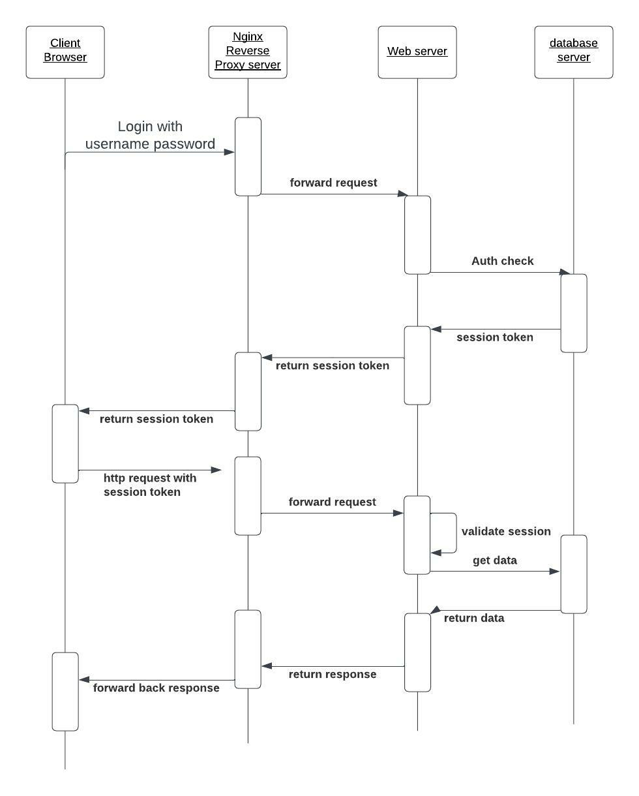

## Setup

1. Start by cloning this repository locally.
2. Build and run the docker containers by running following command:
    ```
    docker-compose up --build -d
    ```
    ```
    composer setup-local
    ```
3. Run task:
    ```
    composer print-film
    ```

4. Sequence Diagram



## Author
Ryan Zeng(zengruijiang@gmail.com)
